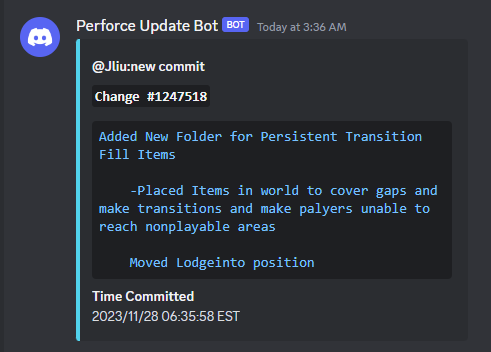

# Perforce Discord Submit logger 📫
A simple python program to use with a scheduler that will notify a provided discord channel when changes have been submitted to a perforce repository.
This bot is inspired by the limitations encountered when using [James Ives's Perforce Commit Logger](https://github.com/JamesIves/perforce-commit-discord-bot). 
Utilizes a large portion of [Perforce-discord-botlogger](https://github.com/TibRib/Perforce-discord-botlogger) but changed to slightly including a minor redesign to an Embed. Sadly removes the cute footer message



# Requirements
The app is a python script that uses the [p4 changes](https://www.perforce.com/manuals/cmdref/Content/CmdRef/p4_changes.html) command, you need to make sure you have a constant access to `p4 changes`.
You can try to run ```p4 changes -m 1``` to see if you are connected.
### Requirements: [Helix Command-Line Client](https://www.perforce.com/products/helix-core-apps/command-line-client)

## Python requirements
Make sure to run
```
cd app
pip install -r requirements.txt
``` 
before first running the program (python3 required of course).

# Configuration
You need to configure some options declared in the `config.ini` file:
```ini
[Discord]
webhook = YOUR_WEBHOOK_URL_HERE

[Perforce]
#Suggestion : set target to empty for a root changelist
target = //MY_PERFORCE_FOLDER/...

[ApplicationSettings]
max_changes = 10
enable_signature = yes
```
If you don't know how to obtain a discord webhook url for your text channel, take a look at [this discord article](https://support.discord.com/hc/en-us/articles/228383668-Intro-to-Webhooks).

## Set the changelist last stamp
As the bot is likely to be used on an already existing perforce environment, you need to change the value in the file ```last_change.ini```. Replace 0 with the latest change number.

Once the bot runs, this file will be updated every time a newer submit is found.
### Exemple:
I get the latest change on my perforce server.
```css
C:\Users\Me> p4 changes -m 1
Change 139208 on 2022/06/01 by someone@MY_LAPTOP 'new feature'
```
The number can now be written to the ini, by opening the file in your text editor or using a terminal.
```sh
echo 139208 > app/last_change.ini
```

# Automated run (Schedule)
Same as for my tip on the loggin, if you are on Windows,
1. Add a task to your [Windows Scheduler](https://digicruncher.com/task-scheduler-in-windows-10/) to run this batch program every 5/10 minutes.
2. Set Action to "Start a program" and script to "/path/to/pythonw.exe" and add arguments to "/path/to/app.py"
3. That's all ! 

## Notes
- ARM64 is not supported by helix perforce. Given that, a raspberry type dedicated server **cannot** be used to host this bot...
- This bot is well suited for a dedicated python server on cloud instances (AWS, Azure, Google Cloud...)


# Licence and credits
The licence for this project is MIT.

The project is inspired by Perforce Commit Logger, by James Ives.  https://github.com/JamesIves/perforce-commit-discord-bot
